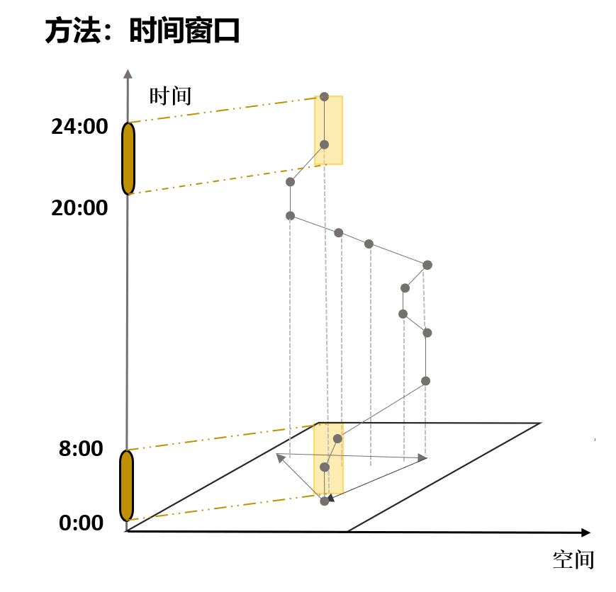

# MOBILE_DATA_PROCESS
这个项目是一个基于transbigdata(Python)的用户移动数据分析工具，它用于处理和分析手机信令数据，区分提取个体用户的活动\停留点,以检测用户的居住地和工作地点,可用于城市科学相关领域的科研学习分析

## 功能
- 将研究区域进行网格划分
- 检测,区分用户的停留轨迹数据以及移动轨迹数据
- 识别用户居住点与工作地点

## 使用说明
- 确保已经安装了所有必须Python库:
    - pandas
    - geopandas
    - transbigdata
- 配置config/config.py文件:
    - MOBILE_PATH: 输入你的信令数据集路径，可以是.csv或.xlsx格式的文件。
    - BOUNDARY_PATH: 输入城市行政区域边界数据的路径，可以是.shp或.geojson格式的文件。
    - columns_in_mobile: 对应你的信令数据中的['用户唯一标识','数据发生时间','经度','纬度']字段。
    - GRID_SIZE: 网格大小(m)，将城市进行网格划分。
    - DAYTIME_START: 白天开始时间，用于区分检测居住地与工作地点的时间划分界限。
    - DAYTIME_END: 白天结束时间。
    - STAY_THRESHOLD: 手机信令轨迹点移动-静止判断阈值。
    - WORK_THRESHOLD: 工作地点检测的时间阈值。
- 配置完成后,直接运行main.py

## 你会得到什么?
- grids.shp 网格划分后的矢量文件,存储在results/grids文件夹下,其具有LONCOL及LATCOL标识编号
- stay.csv  个体用户停留数据,存储在results/activity文件夹下,每一行都记录了特定用户在某段时间内静止状态下的时空信息,时间包括开始时间,结束时间,空间信息为LONCOL与LATCOL编号,与grids.shp一一对应
- move.csv  个体用户活动数据,类似stay.csv,存储在results/activity文件夹下
- matched_home.csv 个体用户居住地检测结果,代表信令数据时段内该用户在夜晚时段停留最长的居住点,存储在results/detected文件夹
- matched_work_location.csv 个体用户工作地点检测结果,代表信令数据时段用户在白天时间停留最长的工作地点,且阈值大于某数值(config.py配置)

## 算法原理:
- 出行链构建+时间窗口划分.如图所示,居住地检测原理为提取出用户在20:00-次日8:00时段内停留最长时间的空间位置.工作地点原理类似

## 依赖仓库:
- transbigdata(https://github.com/ni1o1/transbigdata)

## 参考文献:
- 曹劲舟,涂伟,李清泉等.基于大规模手机定位数据的群体活动时空特征分析[J].地球信息科学学报,2017,19(04):467-474.